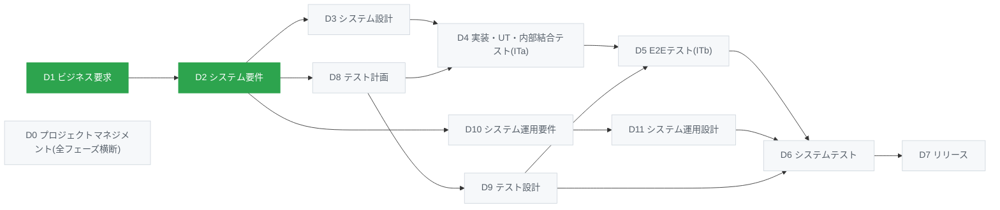

<div align="center">
<!-- TODO: ロゴができたら差し替え(static/img/ に配置)

-->

# KARURA
 
**ビジネス要求から保守運用まで、成果物を一貫生成する<br>エンタープライズ向けAI駆動開発総合ソリューション**
 
[](LICENSE)
[](https://github.com/Acceler-Digital/karura/releases)
[](#環境準備)
[](#環境準備)
[](https://docusaurus.io/)

[](docs/D0.project-management/artifact-flow.md)
[](handbook/README.md)
[](https://www.acceler-digital.com/)
</div>

## KARURAとは

KARURAは、Acceler DigitalのAI駆動開発の知見を体系化した、エンタープライズ向けAI駆動開発総合ソリューションです。大規模、且つ、ミッションクリティカルなシステム開発を対象に、生成AI(Claude Code等)を使ってビジネス要求からリリース・保守運用までの成果物を一貫した体系として生成するための仕組み一式を提供します。

> [!TIP]
> **まず実物を見たい方へ** - KARURAで実際に生成した成果物一式は[成果物サンプル(生命保険 新契約システム)](https://github.com/Acceler-Digital/karura-sample-artifacts-individual-life-insurance-new-business)で公開しています。

| 収録要素 | 該当成果物 | 内容 |
| --- | --- | --- |
| **スキル定義** | [plugin/skills/](plugin/skills/) | Claudeが各成果物を生成・更新するための振る舞いルール。プラグイン導入後 `/karura:<スキル名>` で呼び出し。 |
| **成果物テンプレート** | [plugin/skills/](plugin/skills/) 配下の各スキルの `template.md` | 成果物の骨組み(章構成・書き方ヒント)。AIが読み込んで記入するフォーマット。 |
| **プロジェクト共通規約** | [plugin/skills/karura-conventions/](plugin/skills/karura-conventions/) | プレースホルダ・ID 表記・文体などの横断規約。各スキルが生成・更新前に必ず参照。 |
| **成果物フロー** | [docs/D0.project-management/artifact-flow.md](docs/D0.project-management/artifact-flow.md) | 全成果物の input/outputの依存関係・生成順の定義 |
| **周辺スクリプト群** | [plugin/scripts/](plugin/scripts/) ・ [scripts/](scripts/) | セキュリティガードレール(plugin/scripts/、プラグイン同梱)や、マーカー集計等の補助スクリプト(scripts/) |
| **Wiki(Docusaurus)** | [docusaurus.config.ts](docusaurus.config.ts) ・ [sidebars.ts](sidebars.ts)等 | プロジェクトで使用する成果物をWikiサイトとしてプレビュー(Confluence/Notion等を使う場合は不要) |
 
## 成果物フロー

KARURAにおいて、中核となる考え方が[成果物フロー](docs/D0.project-management/artifact-flow.drawio.svg)です。各成果物が何をインプットとし、何をアウトプットするのか、成果物同士の依存関係を定義したものであり、KARURAにおけるAIの挙動の根底になります。

各成果物はD0~D11のフェーズに分かれており、フェーズ単位の簡略版の全体像は以下の通りです。



🟩 = 本リポジトリに収録しているフェーズ

## ハンドブック

KARURA全体の考え方と、収録している各成果物の目的・作り込み/レビューの勘所は、リポジトリ直下の [handbook/](handbook/README.md) にまとめています。収録しているスキルの一覧もこちらで確認できます。

## クイックスタート

### 環境準備

KARURA の利用に必要なツールは以下の通りです。用途に応じて導入してください(インストールが必要なものはすべてこの欄に集約しています)。

| ツール | 用途 | 備考 |
| --- | --- | --- |
| [Claude Code](https://code.claude.com/) | 成果物の生成・更新(必須) | — |
| `git` | バージョン管理・セキュリティスキャンの差分検出(必須) | 通常はプリインストール済み |
| `bash` | セキュリティスキャン(Stop フック・pre-commit)の実行 | macOS / Linux は標準搭載。**Windows は WSL または Git Bash が必要** |
| `jq` | セキュリティスキャンの結果整形 | macOS・多くの Linux でも**標準では未導入**のため別途インストール(例: macOS `brew install jq`、Debian/Ubuntu `apt install jq`) |
| Node.js 18 以上・pnpm 9 以上 | Docusaurus での Wiki プレビュー(任意) | Confluence / Notion 等で閲覧する場合は不要 |

> [!NOTE]
> **対応 OS は macOS / Linux です。** セキュリティスキャンは bash スクリプトで実装しているため、**Windows は WSL または Git Bash 経由**で利用してください。コマンドプロンプト・PowerShell 単体ではフックが起動しません(スキャンは警告目的の advisory 設計のため成果物生成そのものは止まりませんが、コミット前チェックが効かなくなるため WSL / Git Bash を推奨します)。

### 1. KARURA プラグインの導入
 
自分のプロジェクトで Claude Code を起動し、マーケットプレイスを追加してプラグインをインストールします。リポジトリの clone は不要です。

```
/plugin marketplace add Acceler-Digital/karura
/plugin install karura@acceler-digital
```

導入後、各成果物のスキルが `/karura:<スキル名>` で呼び出せるようになり、生成完了時のセキュリティスキャン(Stop フック)もプラグイン同梱で有効になります。Wiki プレビュー(Docusaurus)やコミット時の pre-commit スキャンなど、リポジトリ本体の機能を使いたい場合のみ別途 clone してください(→ [Wiki プレビュー](#wiki-プレビューdocusaurus))。
 
### 2. 最初の成果物を生成する
 
プロジェクト立ち上げの起点はビジネス要件定義書です。プラグインを導入したプロジェクトで Claude Code を起動し、スラッシュコマンドを実行します。
 
```
/karura:d1-business-requirement-document
```
 
以降は[成果物フロー](docs/D0.project-management/artifact-flow.md)に沿って、各成果物のスラッシュコマンド(`/karura:d1-actor-list`、`/karura:d2-function-list` など)を順に実行していきます。上流の成果物を入力として下流の成果物が生成されるため、生成順はフローに従ってください。
 
生成された成果物は、KARURA プラグインを導入した **あなたのプロジェクトの `docs/` 配下** に配置していく運用を想定しています。本リポジトリ(karura)自体の `docs/` には、フェーズのプレースホルダとなる空ディレクトリと、成果物フロー等のメタ情報のみを置いています(生成物の実例は [成果物サンプル](#成果物サンプル) を参照)。

## 本リポジトリに含まれないもの

本リポジトリ(OSS 版)は、KARURA の全体像を理解し、上流工程を中心に体験していただくためのものです。以下は**含まれません**。

- **全フェーズ・全成果物のスキル / テンプレート一式** — 成果物フローには 80 種類以上の成果物を定義していますが、本リポジトリには一部のフェーズのみを収録しています。今後も拡張を続けますが、全量を収録する予定はありません
- **導入・伴走サポート** — プロジェクトへの導入支援、成果物のレビュー、プロジェクト特性に合わせたスキル / テンプレートのカスタマイズ

全フェーズに対応した完全版の提供や、導入・伴走サポートが必要な場合は、別途ご契約のうえで提供しています。[Acceler Digital](https://www.acceler-digital.com/) までお問い合わせください。
 
## 付属ツール
 
### 要確認マーカーの集計
 
AI は自身で生成した内容に自信がない場合、要確認マーカーを付けます。[docs/](docs/) 配下に残っている未確定マーカー(プレースホルダ `{{xxx}}` と要確認マーカー `要確認`)の件数・該当ファイルを以下で集計できます。レビュー時の気付き支援用で、CI で fail させる目的ではありません(スクリプトは常に exit 0)。
 
```bash
pnpm check:markers
```
 
実体は [scripts/check-markers.sh](scripts/check-markers.sh) です。マーカー記法は [CLAUDE.md](CLAUDE.md) §1〜§3 を参照してください。
 
### セキュリティ・スキャン
 
本リポジトリ(および KARURA で運用するリポジトリ)は、公開リポジトリにシークレットや機微情報が混入しないよう、二段でスキャンを行います。スキャンには `bash` / `git` / `jq` を使用します(導入方法は[環境準備](#環境準備)を参照)。
 
1. **生成完了時(Claude Code の Stop フック)** — Claude が応答を終えると未コミットの変更を自動スキャンし、検出があれば警告します(停止はブロックしない、気付き目的)
2. **コミット時(git pre-commit / 最終防衛線)** — ステージ済みファイルをスキャンし、**high を検出するとコミットを中止**します
```bash
# 手動スキャン
pnpm check:security
```
 
検出対象・重大度・誤検知除外の詳細は [SECURITY.md](SECURITY.md) を参照してください。実体は [plugin/scripts/security-scan.sh](plugin/scripts/security-scan.sh) ・ [.githooks/pre-commit](.githooks/pre-commit) です。
 
### Wiki プレビュー(Docusaurus)
 
[docs/](docs/) 配下の Markdown は [Docusaurus 3](https://docusaurus.io/) で Wiki サイトとしてプレビューできます。プロジェクト側で Confluence や Notion を使う場合は不要です。サイドバー構成は [sidebars.ts](sidebars.ts) を参照してください。
 
```bash
pnpm start          # 開発サーバー起動(http://localhost:3000)
pnpm build          # 本番ビルド
pnpm serve          # ビルド後のプレビュー
pnpm build:offline  # オフライン閲覧用ビルド(hash router・検索インデックス同梱)
```

## リポジトリ構成
 
```
.
├── plugin/                        # KARURA プラグイン本体(/plugin install で配布)
│   ├── .claude-plugin/
│   │   └── plugin.json            # プラグインマニフェスト
│   ├── skills/                    # Claude スキル定義(フェーズ別、テンプレート同梱)
│   │   ├── d1-business-requirement-document/
│   │   │   ├── SKILL.md           # スキル本体(振る舞いルール)
│   │   │   └── template.md        # 成果物テンプレート(章構成・書き方ヒント入り)
│   │   ├── karura-conventions/    # 横断規約スキル(各スキルが生成前に参照)
│   │   └── ...                    # d1-* / d2-* 各スキル
│   ├── hooks/
│   │   └── hooks.json             # 生成完了時セキュリティスキャン(Stop フック)
│   └── scripts/
│       └── security-scan.sh       # セキュリティスキャン本体
├── .claude-plugin/
│   └── marketplace.json           # マーケットプレイスマニフェスト(モノレポ配信)
├── .claude/
│   └── settings.json              # Claude Code 設定(allowlist 等)
├── docs/                          # メタ情報・フェーズ用プレースホルダ
│   └── D0.project-management/     # 成果物フロー・プロジェクトインデックス
├── handbook/                      # KARURA の設計思想・方法論の解説(Docusaurus 非依存)
├── scripts/                       # 補助スクリプト(check-markers.sh・deploy-s3.sh 等)
├── .githooks/
│   └── pre-commit                 # コミット時セキュリティスキャン(plugin/scripts を呼ぶ)
├── sidebars.ts                    # Docusaurus サイドバー定義
├── docusaurus.config.ts           # Docusaurus 設定
├── CLAUDE.md                      # プロジェクト共通の慣習
├── SECURITY.md                    # セキュリティスキャンの説明
└── package.json
```

## 成果物サンプル
KARURAを使用した成果物サンプルとして、以下リポジトリをご用意しております。実際にプロジェクトに適用する前に、各成果物に対するイメージを掴む際にご利用ください。

👉 **[KARURA 成果物サンプル - 生命保険 新契約システム](https://github.com/Acceler-Digital/karura-sample-artifacts-individual-life-insurance-new-business)**

## お問い合わせ
 
- **バグ報告・改善提案** — [GitHub Issues](https://github.com/Acceler-Digital/karura/issues)
- **完全版の提供・導入支援・伴走サポートのご相談** — Acceler Digitalのお問い合わせ窓口までお願いいたします。
[](https://www.acceler-digital.com/)


## ライセンス
 
本リポジトリに含まれるドキュメント・図・設定ファイル・スクリプトは [Apache License 2.0](https://www.apache.org/licenses/LICENSE-2.0) の下で提供されます。全文は同梱の [LICENSE](LICENSE) を参照してください。